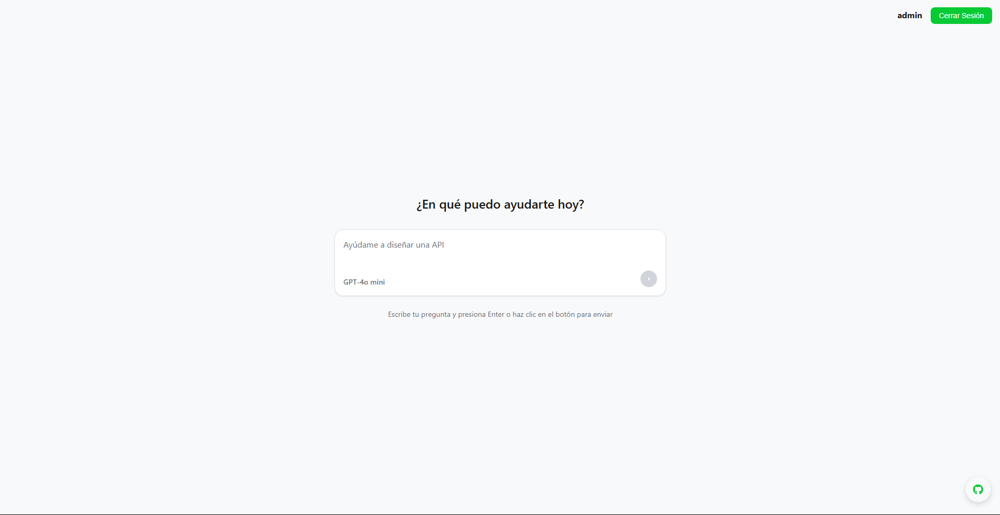
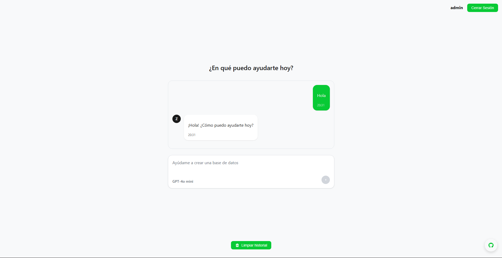
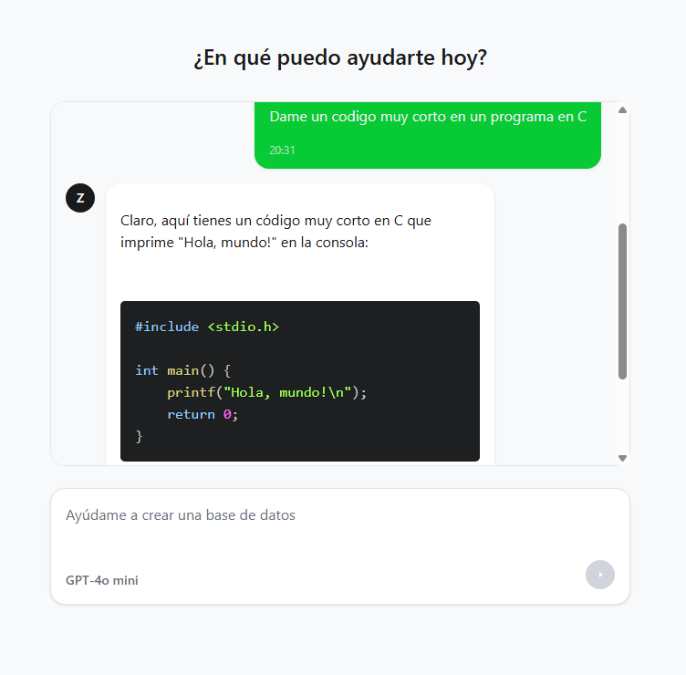
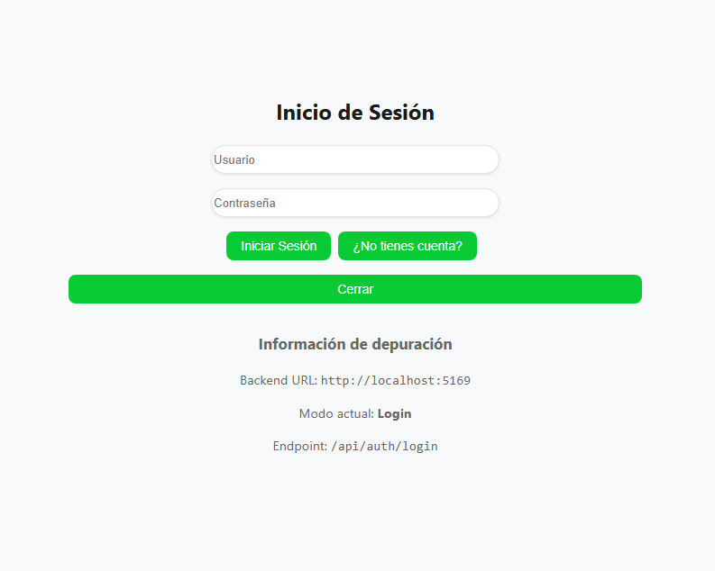

Este proyecto es una aplicación **full stack** que combina un **backend** desarrollado en .NET con C# y un **frontend** desarrollado con React. A continuación, se describen los pasos básicos para ejecutarlo de forma local, así como información general sobre la estructura del proyecto.

## Capturas






## Requisitos previos

- **.NET SDK** (versión recomendada: 8.0 o superior)
- **Node.js** (versión recomendada: 18 o superior)
- **npm** (incluido con Node.js) o **yarn**

## Estructura del proyecto
- **backend/**: Contiene el proyecto de .NET que maneja la lógica de la aplicación, las rutas de la API y la conexión con la base de datos.
- **frontend/**: Contiene la aplicación React que se comunica con el backend y gestiona la interfaz de usuario.
- **install-dependencies.bat**: Script para instalar las dependencias del proyecto (tanto en el backend como en el frontend) desde la línea de comandos.
- **run.bat**: Script rápido para ejecutar ambos proyectos (backend y frontend) en simultáneo.

## Instrucciones de instalación

1. **Clonar el repositorio** o descargar la carpeta del proyecto.
      ```
    git clone https://github.com/joacolns/zyuz-ai.git
      ```

2. **Instalar dependencias**:
    - Para el **backend**:  
      Ingresa a la carpeta `backend` y ejecuta:
      ```bash
      dotnet restore
      ```
    - Para el **frontend**:  
      Ingresa a la carpeta `frontend` y ejecuta:
      ```bash
      npm install
      ```


Si estás en Windows, podes usar directamente el script `install-dependencies.bat` para realizar este proceso automáticamente.

## Configuración de variables de entorno

- Para el **backend**, se recomienda configurar un archivo de entorno (por ejemplo, `.env`) con la API de OpenAI (OPEN_AI_KEY), o cualquier API compatible con la estructura de OpenAI, y una Key JWT (JWT_KEY).
- Para la base de datos, se puede configurar la cadena de conexión en el archivo `appsettings.json` o en un archivo `.env` si se prefiere.
    - Ejemplo de configuración en `.env`:
      ```
      OPEN_AI_KEY=tu_clave_de_openai
      JWT_KEY=tu_clave_jwt
      ```

    - La cadena de conexión a la base de datos puede configurarse directamente en `appsettings.json` o también mediante una variable de entorno:
      ```json
      "ConnectionStrings": {
        "DefaultConnection": "Server=localhost;Database=zyuzai;User Id=sa;Password=tu_contraseña;"
      }
      ```
    - Para obtener una key JWT, puedes usar herramientas como [jwt.io](https://jwt.io/) o OpenSSL, para generarla.
- Ejecutar el siguiente archivo en mySQL Workbench para crear la base de datos (en ./backend):
  ```bash
  crear_base_datos.sql
  ```
  o de forma manual:
  ```bash
  CREATE DATABASE zyuz_database_local;
  USE zyuz_database_local;

  CREATE TABLE users (
  id SERIAL PRIMARY KEY,
  username VARCHAR(255) UNIQUE NOT NULL,
  email VARCHAR(255) UNIQUE NOT NULL,
  password VARCHAR(255) NOT NULL,
  created_at TIMESTAMP DEFAULT CURRENT_TIMESTAMP,
  updated_at TIMESTAMP DEFAULT CURRENT_TIMESTAMP
  );
  ```
    - Luego, dar de alta el servicio Apache y MySQL en Laragon, XAMPP, WAMP, o el gestor de base de datos que estés utilizando.
- Para el **frontend**, se pueden configurar variables en el archivo de entorno por defecto (`.env`) o en uno adicional (`.env.development`) para aspectos como la URL del backend si fuera necesario.

## Ejecución

### Backend

Para iniciar el servidor .NET, (estando dentro de la carpeta `backend`):
```
bash dotnet run
```

O abrir desde Visual Studio IDE 2022 y ejecutar el proyecto.

### Frontend

Para iniciar la aplicación de React, (dentro de la carpeta `frontend`):
```
bash npm run dev
```
o
```
bash yarn dev
```


### Ejecución conjunta (Windows)

Si usas Windows, puedes iniciar ambos proyectos con un solo comando ejecutando:
```
bash run.bat
```

De esta forma, se lanza el servidor .NET con el frontend de React simultáneamente.

## Ejecución del backend en Docker

Para ejecutar el backend en Docker, asegúrate de tener Docker instalado y configurado. Luego, sigue estos pasos:

Genera un certificado de desarrollo HTTPS para .NET Core si aún no lo tienes:

```
mkdir -Force $env:USERPROFILE\.aspnet\https
ENV ASPNETCORE_Kestrel__Certificates__Default__Password="contraseña"
dotnet dev-certs https -ep $env:USERPROFILE\.aspnet\https\aspnetapp.pfx -p contraseña // Reemplaza "contraseña" con una contraseña segura de tu elección, la misma que el ENV ASPNETCORE_Kestrel__Certificates__Default__Password
dotnet dev-certs https --trust
```

Compila el proyecto de .NET y crea la imagen de Docker:

```
docker build -t zyuz-backend .
docker run -p 5169:5169 -p 7106:7106 -v $env:USERPROFILE\.aspnet\https:/https/ --env-file ./.env zyuz-backend
```

## Características principales

- **Backend con .NET**: Se encarga de la lógica y la gestión de datos.
- **Frontend con React**: Interfaz moderna y fácil de ampliar, creada con Vital Framework.
- **Scripts automatizados**: Facilitan la instalación de dependencias y la ejecución conjunta de la aplicación.

## Personalización

- En caso de querer modificar la configuración del proyecto, revisa los archivos de configuración de .NET y el archivo `vite.config.js` del frontend para ajustar puertos, rutas o entornos de desarrollo y producción.
- Para gestionar librerías de Node, se puede editar el archivo `package.json` en la carpeta `frontend`.
- Para actualizar dependencias de .NET, se usan los comandos `dotnet add package` o `dotnet restore` en la carpeta `backend`.

## Contribuciones

1. Haz un **fork** del repositorio.
2. Crea una rama para tu feature o corrección de bug.
3. Commitea tus cambios y envía un pull request.

## Licencia
Este proyecto está licenciado bajo la licencia GNU. Consulta el archivo [LICENSE](LICENSE) para más detalles.